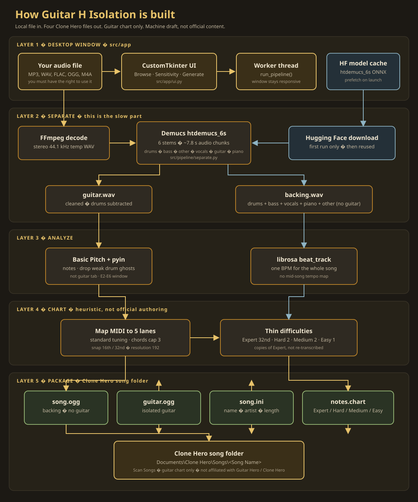
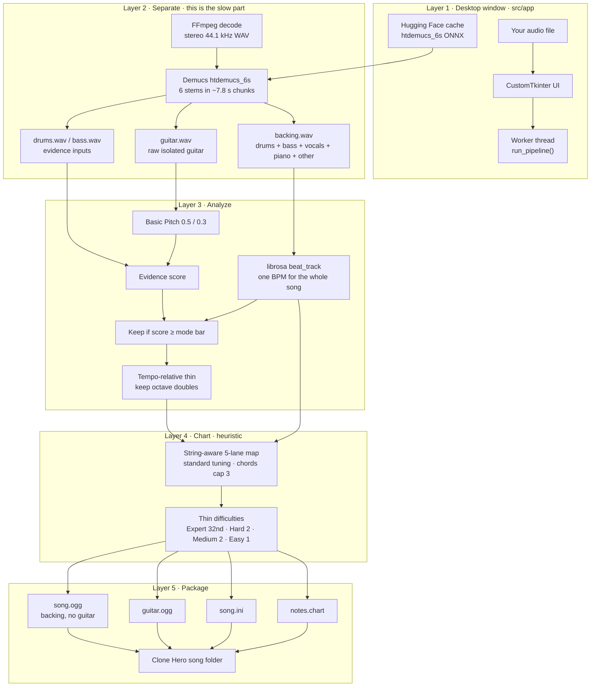

# Guitar H Isolation: architecture and honesty

This document explains what the app actually does, what it does not do, and why some steps take a long time. It is written for players and for anyone who wants to audit the pipeline.

This project is not affiliated with Guitar Hero, Harmonix, or Clone Hero. Charts are machine drafts. They are playable. They are not community-polish charts.

The app is free to download and run. There is no account, subscription, or paid tier. Processing stays on your machine.

Only process audio you have the right to use.

---

## What you get

You pick a local audio file. The app writes one Clone Hero song folder with four files:

| File | What it is |
| --- | --- |
| `song.ogg` | The mix **minus guitar**: drums + bass + vocals + piano + other |
| `guitar.ogg` | The isolated guitar stem |
| `song.ini` | Name, artist, charter, length |
| `notes.chart` | 5-fret guitar notes on Expert, Hard, Medium, and Easy |

Clone Hero plays `song.ogg` as the backing track and `guitar.ogg` as the guitar stem. Together they sound like the full mix **without doubling the guitar**. That is intentional. If `song.ogg` were the original mix, you would hear two guitars.

This version charts **guitar only**. It does not make drum, bass, or vocal charts.

---

## Big picture

Five layers. The guitar path is gold. The backing / tempo path is blue-gray. They meet when the chart is written.



Same flow as text, if the image does not load:



The diagram is five processing layers. The code that runs them is two pieces:

1. **Desktop UI** (`src/app`) — CustomTkinter window. Browse, sensitivity, Generate, progress, open folder.
2. **Pipeline** (`src/pipeline`) — the work above. The UI starts it on a background thread so the window does not freeze.

`python -m src.app.main` or `run.bat` starts the UI. `--demo` prefills the public acoustic clip and starts Generate.

---

## Why the first run is slow

Two different waits get mixed together. They are not the same.

### 1. Hugging Face model download (first time only)

The guitar splitter is an ONNX model hosted on Hugging Face:

- Repo: `StemSplitio/htdemucs-6s-onnx`
- File: `htdemucs_6s_fp16weights.onnx` (smaller) or `htdemucs_6s.onnx` if that one is already cached
- Size: about 75 to 150 MB

Those “HF token chunks” are **this model arriving over the network**, not your song streaming. After the file is in the local Hugging Face cache, later songs skip this.

The app:

- turns on faster Xet downloads (`HF_XET_HIGH_PERFORMANCE`, 32 parallel range gets)
- prefetches the model in the background when the window opens
- reuses whatever variant is already on disk

Basic Pitch’s note model ships **inside the Python package**. It is not the Hugging Face chunk download you see at startup.

### 2. Isolation compute (every song)

Demucs then runs the model on your audio in about **7.8 second chunks**. A 7 minute song is many ONNX passes. That uses a lot of CPU and RAM (several GB). The progress bar can sit on “Isolating guitar” for 10+ minutes. That is work, not a freeze.

Transcription and chart writing after that are usually much faster.

---

## Stage by stage

### Checking tools

Looks for `ffmpeg` on PATH. Needed to decode the input and to encode OGG. If it is missing, the app stops with an install hint (`winget install Gyan.FFmpeg`).

### Downloading model

Only if the Demucs ONNX file is not already cached. See above.

### Separate (`src/pipeline/separate.py`)

1. FFmpeg decodes the input to a stereo 44.1 kHz WAV in a temp folder.
2. `demucs-onnx` runs `htdemucs_6s` and returns six stems: drums, bass, other, vocals, guitar, piano.
3. **Guitar stem** is the raw Demucs guitar output. Cleanup helpers in `stem_clean.py` are diagnostics only; they are not applied before transcription.
4. **Backing** is the sum of drums + bass + vocals + piano + other. Guitar is left out on purpose. The drums and bass stems are kept for the evidence score.
5. Peaks are normalized if they clip above 1.0.

Honesty about isolation:

- This is source separation, not a studio multitrack.
- Bleed is normal: some guitar stays in “other,” some piano or vocal can leak into guitar.
- Two guitars, heavy distortion, or a buried part will confuse the model.
- We do not claim a clean studio guitar take.

### Transcribe (`src/pipeline/transcribe.py`)

Spotify **Basic Pitch** (ICASSP 2022 ONNX) listens to the guitar stem only.

- Frequency window: about E2 to E6 (82 Hz to 1318 Hz)
- MIDI kept: 40 to 88
- Sensitivity presets: Strict / Balanced / Sensitive. Auto is Balanced unless stem bleed is extreme.
- Balanced is stock Basic Pitch: onset 0.50, frame 0.30. Strict 0.55 / 0.35. Sensitive 0.40 / 0.25.
- Velocity is an evidence input, not a hard gate.
- Each note gets one score: velocity + Basic Pitch sustain − drum/bass dominance only when sustain is low. A weak pyin match can add a little; it never vetoes.
- Modes only move Basic Pitch thresholds and the keep bar.

Output is a list of note events: start time, end time, MIDI pitch, velocity.

Honesty about transcription:

- Basic Pitch estimates pitch from audio. It is not tablature and it does not know which string you used.
- Fast runs, bends, slides, harmonics, and chords are often wrong or flattened.
- If it finds zero notes, Generate fails with a clear error.

### Detecting tempo (`src/pipeline/tempo.py`)

`librosa.beat.beat_track` on the **backing** track (not the guitar stem). BPM is folded into the 70–200 range. If detection fails, it uses 120.

Honesty about tempo:

- One constant BPM is written into the chart. There is no tempo map for ritardandos or mid-song meter changes.
- A wrong BPM shifts every note in time. The chart can still be playable and still feel “off.”

### Chart (`src/pipeline/fretmap.py`)

This is the most important honesty section.

Clone Hero guitar is **five buttons**, not a real fretboard. The app must squash every MIDI pitch onto green / red / yellow / blue / orange.

How Expert is built:

1. Map each MIDI pitch to a fingering on standard tuning (E2 A2 D3 G3 B3 E4), preferring a stable left-hand position.
2. Collapse six strings onto five Clone Hero lanes: low E→green, A→red, D→yellow, G→blue, B and high E→orange.
3. Notes that start within 40 ms are treated as a **chord**, capped at **3** frets.
4. Times are converted to ticks at **resolution 192**.
5. Hits snap toward 16th notes, or 32nds if they are not close enough to a 16th.
6. Sustains shorter than a quarter beat become tap notes (sustain 0). Overlapping sustains on the same fret are clamped.
7. Expert is then density-pruned to a 32nd-note floor so bleed storms stay playable.

Harder / easier tracks are **thinned copies of Expert**, not re-transcribed:

| Difficulty | Max chord | Minimum spacing |
| --- | --- | --- |
| Expert | 3 | 32nd note |
| Hard | 2 | 16th note |
| Medium | 2 | 8th note |
| Easy | 1 | quarter note |

Honesty about charts:

- This is **not** Guitar Hero authoring and **not** real guitar tab.
- Lane colors come from string/fret estimates, not from a human charter.
- Hopos, star power, force flags, tap notes as a special type, and open notes are not written.
- Time signature is hardcoded as 4/4 from tick 0.
- Offset is 0. No calibration pass against Clone Hero video or audio latency.
- Expect extra notes, missing notes, and awkward chords on busy songs.

The charter name written into the files is `Guitar H Isolation`.

### Package (`src/pipeline/package.py`)

FFmpeg encodes the two WAVs to Vorbis OGG (`-q:a 5`). Then it writes `song.ini` and `notes.chart`. The temp work folder is deleted.

`notes.chart` points at:

- `MusicStream = song.ogg`
- `GuitarStream = guitar.ogg`

---

## User interface

`src/app/ui.py` is a dark CustomTkinter window. It has a **Note sensitivity** control: Auto, Strict, Balanced, Sensitive. Auto is the default. **Open song folder** loads an existing Clone Hero / Guitar H Isolation output (any prior app version) and shows name, BPM, and note counts without regenerating.

While Generate runs:

- The button says **Working... do not close this window**
- A banner says the job is still alive
- Status shows the stage, a percent, and elapsed time
- The bar pulses so a long Separate stage does not look frozen

The window also starts a **background prefetch** of the Demucs model so you can pick a file while the one-time download finishes.

Generate work runs on a daemon thread. Progress events are queued back to the UI thread. Closing the window kills that work.

---

## Folder map

```
src/app/main.py          start the window
src/app/ui.py            browse, progress, prefetch
src/pipeline/run.py      stage order
src/pipeline/audio.py    FFmpeg decode / OGG encode
src/pipeline/hf.py       Hugging Face cache and faster downloads
src/pipeline/separate.py Demucs 6-stem split and backing mix
src/pipeline/transcribe.py Basic Pitch + sensitivity presets
src/pipeline/evidence.py   one score per note (sustain / bleed)
src/pipeline/filters.py    score → keep → tempo-relative thin
src/pipeline/refine.py     merge same-pitch overlaps; keep octaves
src/pipeline/song_folder.py open/view existing Clone Hero song folders
src/pipeline/tempo.py    BPM
src/pipeline/stem_clean.py bleed-proxy diagnostics (not on Generate)
src/pipeline/fretmap.py  string-aware 5-lane map + difficulty thinning
src/pipeline/chart_writer.py text .chart
src/pipeline/package.py  song folder
src/pipeline/types.py    shared data shapes
src/pipeline/util.py     filename / default Songs path / ffmpeg check
```

Default output: `Documents\Clone Hero\Songs\<Song Name>`

---

## What this app does not do

- It does not charge money, ask for an account, or unlock features behind a paywall.
- It does not download songs from the internet.
- It does not remove copyright, watermarks, or DRM.
- It does not produce official Guitar Hero or Clone Hero content.
- It does not chart drums, bass, keys, or vocals.
- It does not upload to Chorus, Clone Hero, or any chart site.
- It does not guarantee a shareable community chart. Use Moonscraper if you want to clean one up.

---

## Models and licenses (transparency)

| Piece | Role | Where it comes from |
| --- | --- | --- |
| FFmpeg | decode / encode | your machine PATH |
| demucs-onnx + htdemucs_6s | 6-stem split including guitar | Hugging Face `StemSplitio/htdemucs-6s-onnx` (Meta Demucs family) |
| onnxruntime | run the ONNX graphs | pip |
| Basic Pitch | audio to MIDI-like notes | Spotify model bundled with the `basic-pitch` package |
| librosa | tempo, optional pyin vote, drum onsets | pip |
| scipy | guitar-stem band filters | pip |
| CustomTkinter | window | pip |

The app itself is MIT. Third-party models keep their own licenses. Read those before you ship a commercial product on top of this.

Test audio used in this repo is listed in `tests/fixtures/CLIPS.md` with attribution. Those clips are the only songs this project redistributes.

---

## How to verify a result

1. Open the output folder. You should see exactly those four files.
2. Play `guitar.ogg`. You should mostly hear guitar.
3. Play `song.ogg`. You should hear the rest of the band, not a doubled guitar.
4. Open `notes.chart` in a text editor. You should see `[ExpertSingle]`, `[HardSingle]`, `[MediumSingle]`, `[EasySingle]`.
5. Put the folder inside Clone Hero Songs, then **Settings → General → Scan Songs**.
6. If the song is missing, read `badsongs.txt` in the Clone Hero folder.

---

## Honest quality bar

Proven in this repo on short **public-domain / Creative Commons** clips: the pipeline writes real OGGs and a chart with notes on all four difficulties.

Quantitative regression numbers live in [`tests/eval/BASELINE.md`](tests/eval/BASELINE.md). Post-filter scores use the **full shipped chain** (evidence score → tempo-relative thin → Expert prune). Re-run with `python -m tests.eval.run_baseline`. Independent real-audio scores vs the pre-`bc00cd4` 0.5/0.3 reference: `python -m tests.eval.run_guitarset`.

Not proven, and not claimed:

- launching Clone Hero for you
- matching a human charter’s note choice
- working well on every commercial mix
- beat-perfect sync on every song

If a chart feels wrong, the usual causes are isolation bleed, Basic Pitch errors, or a bad BPM, in that order.

Mitigations in this build:

- Generate transcribes the raw Demucs guitar stem (cleanup helpers are diagnostics only)
- Auto / Strict / Balanced / Sensitive (Basic Pitch thresholds + keep bar; no crest rule)
- one evidence score per note; drum alignment is never a veto
- tempo-relative thinning that keeps power-chord octaves
- string-aware 5-lane fretting with position continuity
- Expert 32nd-note density floor before Hard/Medium/Easy thinning

